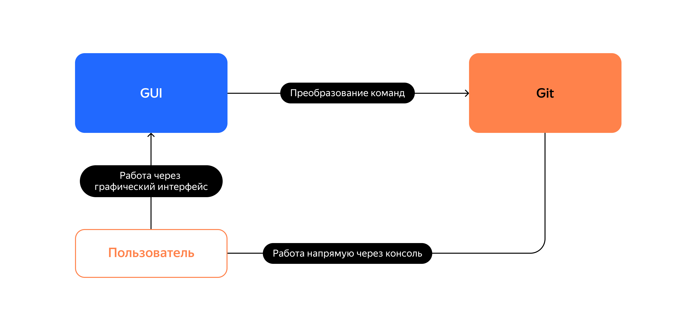
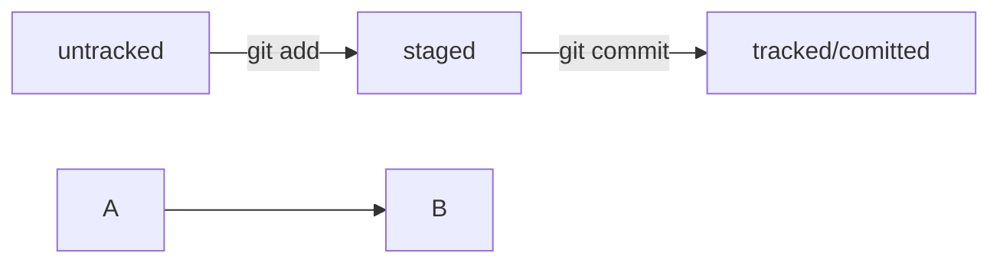
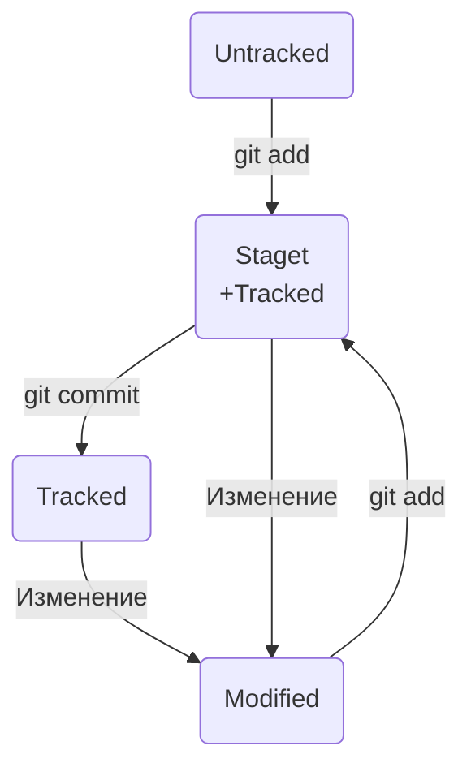
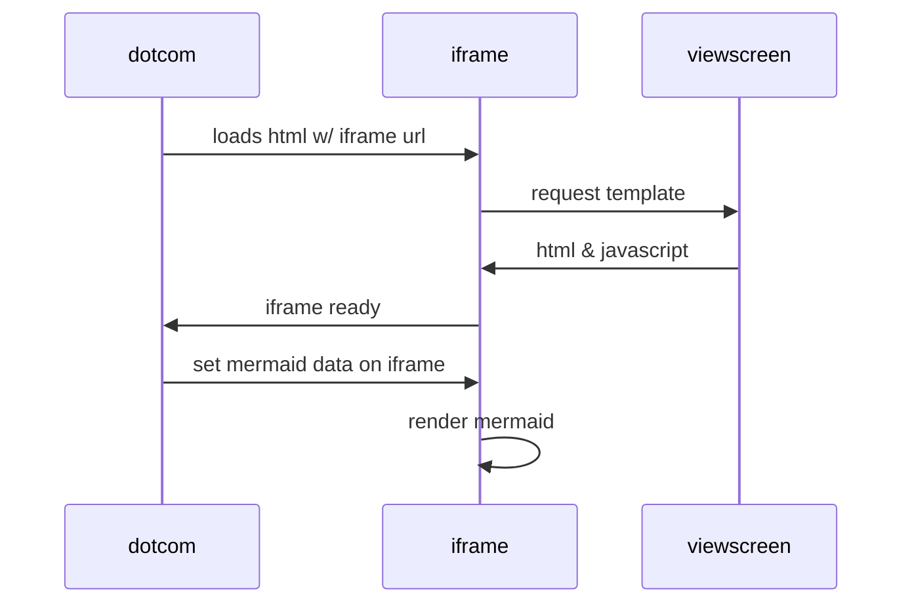

# GIT Яндекс Практикум

# Введение

**VCS** (*Version Control System*) — система контроля версий

**SCM** (*Source Control Management)* — система управления исходным кодом

**Ревизией** == **Версия** — содержит что изменидлсь, кто внес изменения, кода было изменение, коментарий к изменению

Основные функции системы контроля версий:

- хранит историю изменений в виде отдельных ревизий;
- позволяет манипулировать историей: например, менять порядок ревизий, полностью удалять версии, возвращаться назад в истории;
- помогает анализировать изменения: например, кто и когда вносит изменения, кто чаще всего вносит изменения в определённый файл и так далее.

> Система контроля версий — общее название ряда продуктов, таких как Git, Mercurial, Subversion и других.
> 

**CLI** (*Command-line Interface*) — командная строка

**Консольные** и **графические интерфейсы** — два способа взаимодействия с программами

**Консоль**, **терминал**, или **командная строка**, — это программа, которая считывает команду пользователя и выполняет её.



Запустите программу **Terminal**

- для Linux — `Ctrl+Alt+T`;
- для macOS — `Cmd+Space`, затем ввести `terminal`

# Команды терминала

**`pwd`** — (*print working directory*) показать рабочую папку

`**cd**` — (*change directory*) сменить директорию

**`~`** — обозначение домашней директории

**`ls`** — (*list directory contents)* отобразить содержимое директории

**`..`** — вернуться на уровень выше

**`.`** — обратиться к текущей директории

**Флаг** **`-a`** пример `ls -a`  — вывести расширенный список (отоброзит все файлы начинающиеся с `.` т.е. файлы конфигурации, а также файл `.` и `..` которые обозначают текущую и родительскую директории)

**`touch`** — (*«коснуться»*) ****создать файл (можно создавать сразу несколько файлов указав их через пробел)

**`mkdir`** — (*«make directory»*) создать директорию (можно создавать сразу несколько папок указав их через пробел)

**Флаг `-p`** пример `mkdir -p dir1/dir-inside/dir-deeper-inside` — создать структуру директорий

**`cp что_копируем куда_копируем`** — (*copy* - «копировать») копирование файлов (можно указать сразу несколько файлов `что_копируем что_копируем что_копируем` )

**`mv`** — (*move - «переместить»*) перемещение файлов и папок

**`cat`** —  (*concatenate and print - «объединить и распечатать»*) чтение файлов

**`rm`** — (*remove - «удалить»*) удалить файл

**`rmdir`** — (*remove directory*) *удалить директорию*

**Флаг `-r`** (*recursive - «рекурсивный»*) пример `rm -r` — удалить папку со всем содержимым (**рекурсивно** удаляет файлы и папки)

---

**`&&`** — разделитель для выполнения нескольких команд 

Пример объединения команд

```bash
$ mkdir second-project && cd second-project && touch index.html style.css
# создаём папку second-project,
# переходим в папку second-project
# и создаём в ней два файла: index.html и style.css
```

**`Tab`** автоматически дописывает не только команды, но и пути (дважды нажать клавишу)

# **Настройка Git**

Для начала работы нужно указать имя пользователя и адрес электронной почты.

**`git config`** (*configuration*) — конфигурация, настройка

**Ключ `--global`** (англ. «глобальный»)

**`user.name`** указать имя или никнейм

**`user.email`** указывают электронную почту

```bash
$ git config --global user.name "User_Name"
# имя или ник нужно написать латиницей и в кавычках

$ git config --global user.email username@yandex.ru
# здесь нужно указать свой настоящий email
```

Все глобальные настройки Git хранит в файле **`.gitconfig`** в домашней директории

Посмотреть файл можно командой

```bash
$ cat ~/.gitconfig
или
$ git config --list 
```

# Инициализация репозитория

**`git init`** — (*repository* - «хранилище», *initialize -* «инициализировать») сделать папку репозиторием (Чтобы Git начал отслеживать изменения)

**`rm -rf .git`** — «разгитить» папку, если что-то пошло не так (удалить скрытую подпапку `.git`)

- **ключ `r`** (*recursive* - «рекурсивно») позволяет удалять папки вместе с их содержимым;
- **ключ `f`** (*force* - «заставить») избавит вас от вопросов вроде «Вы точно хотите удалить этот файл? А этот? И этот тоже?»

`**git status**` — (*status* — «статус», «состояние») проверить текущее состояние репозитория

# **Добавляем файлы в репозиторий (`git add`)**

`**git add <file>**` — добавить файл в репозиторий (**не сохраняет файл в репозиторий**)

**Флаг `--all`** — позволяет подготовить к сохранению все файлы в репозитории

`git add .` — добавить всю текущую папку

# Коммит (`git commit`)

Это как если бы вы могли выполнить операцию `Ctrl+Z` для целой папки (репозитория)

`git commit -m <text_message>`  — сохранить все подготовленные файлы в репозиторий с указанным сообщением

**Флаг `-m`** — (***message*** - «сообщение») присвоить коммиту сообщение

> **PS:** в сообщении `root-commit` это самый первый, или «корневой» (*root*), коммит в ветке, у следующих коммитов такой надписи не будет.
`mode 100644` сообщает, что это обычный файл.
>
>
Также возможны варианты `100755` для исполняемых файлов (например, `что-нибудь.exe`) и `120000` для файлов-ссылок в Linux. 
>
>
Файлы-ссылки не содержат данных сами по себе, а только ссылаются на другие файлы — как «ярлыки» в Windows.
> 

# **Историю коммитов**

**`git log`** — (*log* - «журнал [записей]») просмотреть историю коммитов

Последний коммит выводится сверху

# **SSH-ключ**

**Публичный ключ** (*public key*) для **шифрования** данных

**Приватный ключ** (*private key*) для **расшифровки** данных

**`~/.ssh/`** — директория по умолчанию для хранения SSH-ключей

## **Генерация SSH-ключа**

Для генерации SSH-пары можно использовать программу `ssh-keygen`

```bash
$ ssh-keygen -t ed25519 -C "электронная почта, к которой привязан ваш аккаунт на GitHub"
```

`ed25519` — алгоритм шифрования

- Далее будет предложено выбрать место хранения SSH-пары (можно ничего не менять и нажать `Enter` сделав домашний каталог пользователя путём по умолчанию)
- Далее программа запросит **кодовую фразу** (*passphrase*)
- Ключ создан)

`**ls -a ~/.ssh**` — проверить что ключи сгенерированы

## **Привязываем SSH-ключ к GitHub**

Скопируйте содержимое файла с публичным ключом в буфер обмена.

- **GitHub**  
**Settings** → **SSH and GPG keys** → New SSH key → <Заполнить поля> → Add SSH key
    
    
    
    
    
    
    
    
    

Проверьте правильность ключа с помощью следующей команды

```bash
$ ssh -T git@github.com 
```

При первом подключении к хосту стоит проверить совпадает ли `fingerprint` в консоли с ним же на сайте

# **Связываем локальный и удалённый репозитории**

**GitHub**

Копировать ссылку на странице удаленного репозитория


**В консоли**

1. Прейти в каталог локального репозитория
2. Ввести команду `git remote add` (*remote* - «удалённый», *add* - «добавить»)

```bash
$ cd ~/dev/first-project
$ **git remote add origin URL** 
```

`origin` — имя удалённого репозитория

`URL` — скопированная ссылка со страницы удалённого репозитория

> `origin` (англ. «источник») — стандартный псевдоним, с помощью которого можно обращаться к главному удалённому репозиторию (обычно такой репозиторий один). Это значительно упрощает работу.
> 

**`git remote -v`** — убедиться, что репозитории связаны

**Флаг `-v`** — короткая форма флага `--verbose` - «подробный». Он позволяет показать больше информации в выводе.

```bash
$ git remote -v
origin    git@github.com:%ИМЯ_АККАУНТА%/%ИМЯ-ПРОЕКТА%.git (fetch)
origin    git@github.com:%ИМЯ_АККАУНТА%/%ИМЯ-ПРОЕКТА%.git (push) 
```

# **Синхронизируем локальный и удалённый репозитории**

**`main` или `master`**

**`git push`** — (*push* — «толкать») отправить изменения на удалённый репозиторий

В первый раз эту команду нужно вызвать с флагом `-u` и параметрами `origin` (имя удалённого репозитория) и `main` или `master` (название текущей ветки). 

**Флаг `-u`** свяжет локальную ветку с одноимённой удалённой. 

Как вы связывали локальный и удалённый репозитории в предыдущем уроке, так же и здесь нужно дополнительно связать ветки.

---

# **Хеширование**

**Хеширование** (от англ. *hash*, «рубить», «крошить», «мешанина») — это способ преобразовать набор данных и получить их «отпечаток» (англ. *fingerprint*).

Git хеширует (преобразует) информацию о коммите с помощью алгоритма **SHA-1** (от англ. ***S**ecure **H**ash **A**lgorithm* — «безопасный алгоритм хеширования»)

- Git преобразует информацию о коммитах с помощью алгоритма SHA-1 и для каждого из них рассчитывает уникальный идентификатор — хеш.
- Хеш — основной идентификатор коммита и позволяет узнать его автора, дату и содержимое закоммиченных файлов.
- Все хеши, а также таблицу соответствий `хеш → информация о коммите` Git хранит в папке `.git`.

# Лог (`log`)

`**git log --oneline**` — получить сокращённый лог

# **Файл `HEAD`**

Файл `**HEAD**` — («голова», «головной») — один из служебных файлов папки `.git`. Указывает на файл с хэшом последнего сделанного коммита.

`**HEAD**` — используется как указатель на хэш последнего коммита

# **Статусы файлов в Git**

**Статусы `untracked`/`tracked`, `staged` и `modified`**

**`untracked` —** неотслеживаемый (новые файлы в git)

**`staged`** — подготовленный (после выполнения команды `git add` файл попадает в **staging area** (*stage* - сцена, этап [процесса], и *area* - область), то есть в список файлов, которые войдут в коммит. В этот момент файл находится в состоянии `staged`.

> **Staging area** также называют **index** (каталог) или **cache** (кеш), а состояние файла `staged` иногда называют `indexed` или `cached`.
> 

**`tracked`** — отслеживаемый 

- файлы которые были уже закоммичены командой `git commit`
- файлы, которые были добавлены в **staging area** командой `git add`

**`modified`** — изменённый (файлы которые были изменены относительно последнего коммита)

> **PS:**
> 
> - для файлов в состояниях `staged` и `modified` обычно не указывают, что они также `tracked`, потому что это состояние подразумевается
> - `**staged` и `modified`.** Если откорректировать содержимое файла после того как для него была выполнена команда `git add` корректировка не попадет в **staging area** для внесения корректировок придется еще раз выполнить `git add`

# **Жизненный цикл файла в Git**


# **Как читать git status**

`git status` показывает только следующие состояния файлов:

- `staged` (`Changes to be committed` в выводе `git status`);
- `modified` (`Changes not staged for commit`);
- `untracked` (`Untracked files`).

# **Оформление сообщений к коммитам**

Сообщение не должно быть длиннее 72 символов

Сообщения коммитов — Как и надпись на коробке в кладовой

**Стандарт [Conventional Commits](https://www.conventionalcommits.org/ru/v1.0.0-beta.4/#%D1%81%D0%BF%D0%B5%D1%86%D0%B8%D1%84%D0%B8%D0%BA%D0%B0%D1%86%D0%B8%D1%8F)** (соглашение о коммитах) — стиль оформления коммитов для репозиториев с исходным кодом программ

- `feat` (сокращение от англ. *feature*) — для новой функциональности;
- `fix` (от англ. «исправить», «устранить») — для исправленных ошибок.

```bash
$ git commit -m "feat: добавить подсчёт суммы заказов за неделю" 
```

**GitHub-стиль** — стиль для ведения списка задач (*issue*). Если коммит «закрывает» или «решает» какую-то задачу, то в его сообщении удобно указывать ссылку на неё.

```bash
$ git commit -m "Исправить #334, добавить график температуры" 
```

В таком случае GitHub свяжет коммит и задачу.

# **Mermaid (схемы с блоками и стрелками)**

**Mermaid** — схема в **Markdown**

```
```mermaid
%% описание схемы
```
```

Два символа `%%` обозначают в `mermaid` строку-комментарий

Чтобы сделать схему, нужно указать формат: `graph LR`

**Graph** — это простейший тип схем






